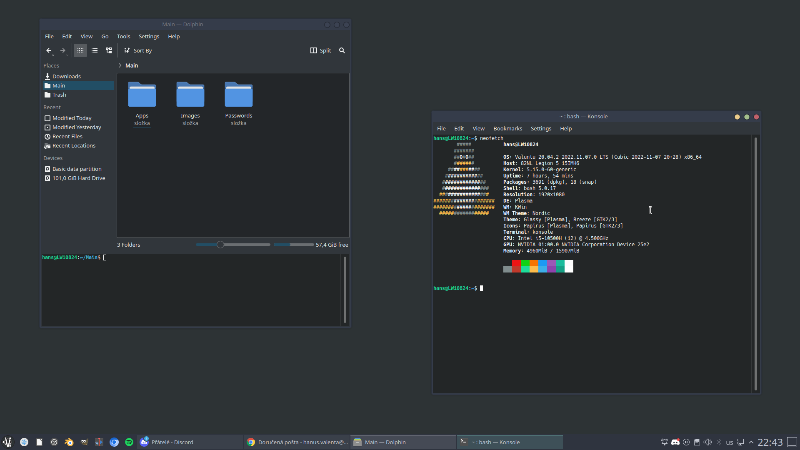
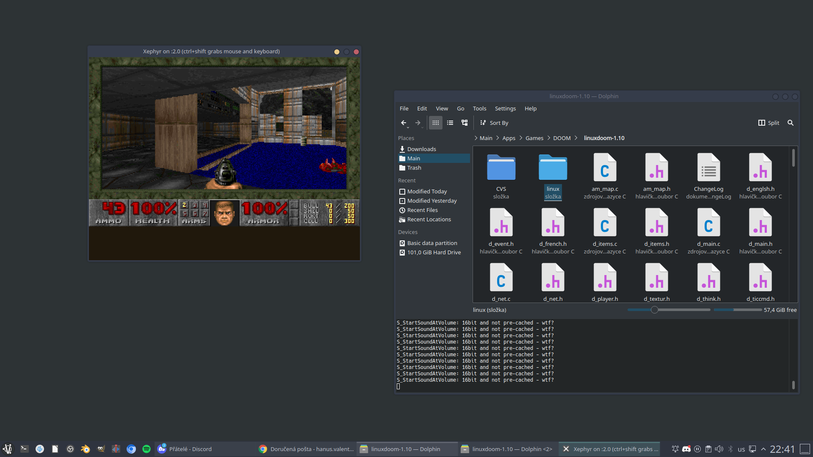

# Valuntu

## Experimental linux distro done for my daily use

a compiled version is currently in the works

made with [ubuntu](https://ubuntu.com/) & inspired by [crunchbang](https://www.crunchbangplusplus.org/)

What it looks like:

WM installed:

* kde
* openbox
* dwm

Pre installed packages:

* wine
* wine32
* libwine
* vlc
* geany
* gimp
* blender
* vim
* emacs
* 7zip
* nano
* obs
* nginx
* inkscaped
* netcat
* llvm
* keepassxc
* copyq
* neofetch
* filezilla
* bash
* wireshark
* kden live
* shortcut
* onlyoffice
* openoffice
* libreoffice
* top
* git
* vscode
* qemu
* gcc
* cmake
* macchanger
* Tor
* Cubic
* net-tools
* qbittorrent
* curl
* aptitude
* godot
* dmenu
* feh

+some nice backgrounds

# Default password is: password

# install at your own risk

yeah and it runs doom but you have to force it hard enough

